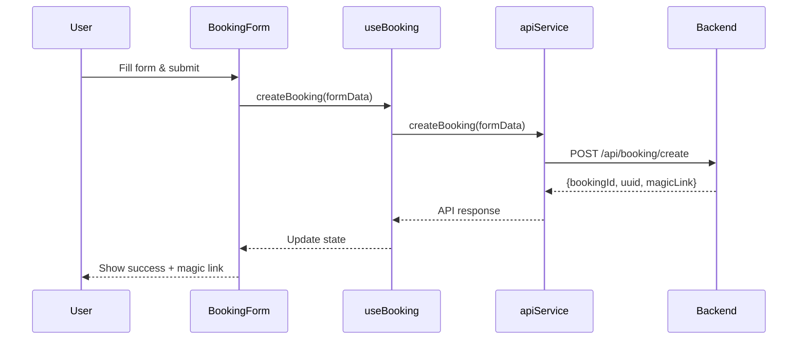
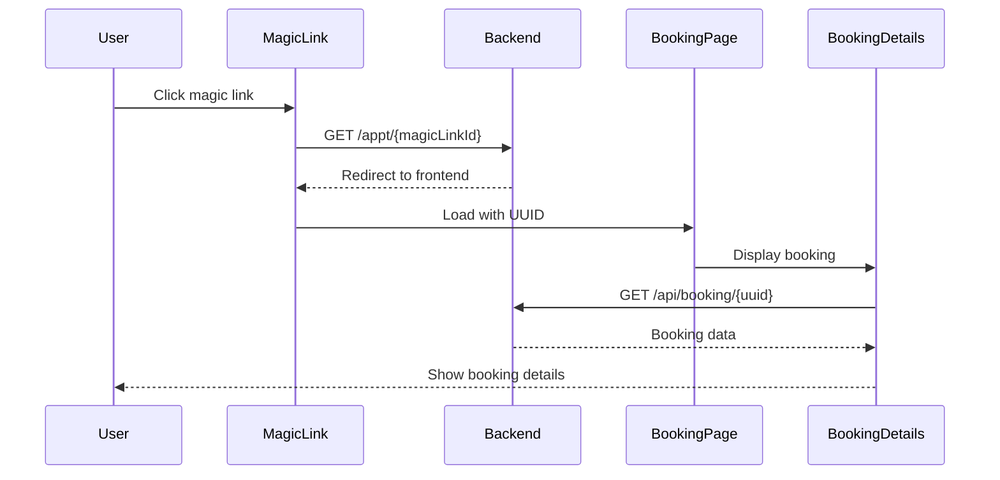

# Frontend API Integration Guide

This document explains how to use the integrated booking system components that connect to the backend APIs described in the README.md.

## 🏗️ Architecture Overview

The frontend integration consists of several layers:

1. **API Service Layer** (`src/services/api.ts`) - Handles all HTTP requests to the backend
2. **React Hooks** (`src/hooks/`) - Manages state and API calls
3. **Components** (`src/components/`) - UI components for booking forms and details
4. **Configuration** (`src/config/environment.ts`) - Environment and API endpoint management

## 📦 Core Components

### 1. API Service (`src/services/api.ts`)

The API service provides a typed interface to all backend endpoints:

```typescript
import { apiService } from '../services/api';

// Create a booking
const response = await apiService.createBooking(bookingData);

// Get booking details
const details = await apiService.getBookingDetails(uuid);

// Update payment status
await apiService.updatePaymentStatus(uuid, { paymentStatus: 'completed' });
```

### 2. Booking Hook (`src/hooks/useBooking.ts`)

React hook for managing booking operations:

```typescript
import { useBooking } from '../hooks/useBooking';

function MyComponent() {
  const { 
    loading, 
    error, 
    success, 
    bookingResponse, 
    createBooking,
    getBookingDetails 
  } = useBooking();
  
  const handleSubmit = async (formData) => {
    await createBooking(formData);
  };
  
  // Handle loading, error, and success states...
}
```

### 3. Magic Link Hook (`src/hooks/useMagicLink.ts`)

React hook for magic link operations:

```typescript
import { useMagicLink } from '../hooks/useMagicLink';

function MagicLinkComponent({ magicLinkId }) {
  const { previewMagicLink, trackEvent } = useMagicLink();
  
  useEffect(() => {
    // Track page view
    trackEvent(magicLinkId, {
      event: 'page_view',
      userAgent: navigator.userAgent
    });
  }, [magicLinkId]);
}
```

## 🎯 Usage Examples

### Creating a Booking Form

```tsx
import { BookingForm } from '../components/BookingForm';

function CreateBookingPage() {
  return (
    <div>
      <h1>Create New Booking</h1>
      <BookingForm 
        onSubmit={(data) => {
          // Optional: Additional handling after booking creation
          console.log('Booking created:', data);
        }}
      />
    </div>
  );
}
```

The `BookingForm` component:
- ✅ Handles form validation
- ✅ Makes API calls automatically
- ✅ Shows loading states
- ✅ Displays success/error messages
- ✅ Shows magic link after successful creation

### Displaying Booking Details

```tsx
import { BookingDetails } from '../components/BookingDetails';

function BookingDetailsPage({ uuid }) {
  return (
    <BookingDetails 
      uuid={uuid}
      onPaymentUpdate={(uuid, status) => {
        console.log(`Payment ${status} for booking ${uuid}`);
      }}
    />
  );
}
```

The `BookingDetails` component:
- ✅ Fetches booking data automatically
- ✅ Shows booking status and payment status
- ✅ Allows confirmation of pending bookings
- ✅ Allows payment status updates
- ✅ Displays timestamps and access analytics

### Complete Booking Page

```tsx
import { BookingPage } from '../pages/BookingPage';

// For creating new bookings
<BookingPage mode="create" />

// For viewing existing bookings
<BookingPage mode="view" uuid="booking-uuid-here" />

// For magic link access
<BookingPage mode="magic-link" uuid="booking-uuid-here" />
```

## ⚙️ Configuration

### Environment Variables

The system supports multiple configuration methods:

#### 1. Build-time Environment Variables
```bash
# .env file
REACT_APP_API_BASE_URL=http://localhost:3000
REACT_APP_MAGIC_LINK_BASE_URL=https://tbook.me
REACT_APP_FRONTEND_BASE_URL=https://usetextbook.com
```

#### 2. Runtime Configuration
```html
<!-- In your HTML head -->
<script>
  window.__APP_CONFIG__ = {
    apiBaseUrl: 'https://api.yourdomain.com',
    magicLinkBaseUrl: 'https://links.yourdomain.com',
    frontendBaseUrl: 'https://yourdomain.com'
  };
</script>
```

#### 3. Using Configuration in Code
```typescript
import { config, getApiUrl, getMagicLinkUrl } from '../config/environment';

// Get full config object
console.log(config.apiBaseUrl);

// Use utility functions
const apiEndpoint = getApiUrl('/api/booking/create');
const magicLink = getMagicLinkUrl('some-magic-id');
```

## 🔄 API Flow Integration

### 1. Creating a Booking



### 2. Magic Link Flow



## 🎨 Styling and Customization

All components use Tailwind CSS classes. You can customize the appearance by:

### 1. Overriding CSS Classes
```typescript
// Extend component props to accept custom classes
interface BookingFormProps {
  className?: string;
  buttonClassName?: string;
}
```

### 2. Custom Themes
```css
/* Custom CSS variables */
:root {
  --booking-primary: #3b82f6;
  --booking-success: #10b981;
  --booking-error: #ef4444;
}
```

## 🧪 Testing

### Manual Testing

1. **Create Booking**
```bash
# Start your backend server on :3000
# Open frontend and fill booking form
# Check network tab for API calls
```

2. **Test Magic Link**
```bash
# Get magic link from booking creation response
# Open magic link in new tab
# Verify redirect and booking display
```

### Integration Testing

```typescript
// Example test setup
import { render, screen, fireEvent, waitFor } from '@testing-library/react';
import { BookingForm } from '../components/BookingForm';

// Mock API service
jest.mock('../services/api');

test('creates booking successfully', async () => {
  render(<BookingForm />);
  
  // Fill form
  fireEvent.change(screen.getByLabelText(/full name/i), {
    target: { value: 'John Doe' }
  });
  
  // Submit
  fireEvent.click(screen.getByText(/create booking/i));
  
  // Wait for success message
  await waitFor(() => {
    expect(screen.getByText(/booking created successfully/i)).toBeInTheDocument();
  });
});
```

## 🚀 Deployment

### 1. Build Configuration
```json
{
  "scripts": {
    "build": "react-scripts build",
    "build:staging": "REACT_APP_API_BASE_URL=https://staging-api.example.com npm run build",
    "build:production": "REACT_APP_API_BASE_URL=https://api.example.com npm run build"
  }
}
```

### 2. Runtime Configuration
```html
<!-- Inject at build time or serve dynamically -->
<script>
  window.__APP_CONFIG__ = {
    apiBaseUrl: '${API_BASE_URL}',
    magicLinkBaseUrl: '${MAGIC_LINK_BASE_URL}',
    frontendBaseUrl: '${FRONTEND_BASE_URL}'
  };
</script>
```

## 🔍 Troubleshooting

### Common Issues

1. **CORS Errors**
   - Ensure backend CORS is configured for your frontend domain
   - Check `CORS_ORIGIN` in backend environment

2. **Environment Variables Not Loading**
   - Ensure variables start with `REACT_APP_`
   - Check browser network tab for actual API calls
   - Verify runtime configuration in browser console

3. **Magic Links Not Working**
   - Verify `MAGIC_LINK_BASE_URL` matches backend configuration
   - Check that frontend URL matches `FRONTEND_BASE_URL` in backend

### Debug Information

```typescript
// Add debug logging
import { config } from '../config/environment';

console.log('App Config:', config);
console.log('API Base URL:', config.apiBaseUrl);

// In components
const { loading, error, success } = useBooking();
console.log('Booking State:', { loading, error, success });
```

## 📚 API Reference

### BookingFormData Interface
```typescript
interface BookingFormData {
  userName: string;
  userPhone: string;
  appointmentType: 'consultation' | 'tutoring' | 'assessment' | 'workshop';
  appointmentDate: string; // ISO date string
  bookingDetails: {
    subject?: string;
    level?: string;
    duration?: number;
    notes?: string;
  };
}
```

### API Response Types
```typescript
interface BookingResponse {
  bookingId: string;      // Human-readable ID
  uuid: string;          // UUID for API calls
  magicLink: string;     // Full magic link URL
  status: string;        // Booking status
  message: string;       // Success message
}

interface BookingDetails {
  id: string;                    // Database ID
  bookingId: string;            // Human-readable ID
  magicLinkId: string;          // Magic link identifier
  userName: string;
  userPhone: string;
  appointmentType: string;
  appointmentDate: string;
  bookingDetails: any;          // Additional details JSON
  status: string;               // Booking status
  paymentStatus: string;        // Payment status
  createdAt: string;           // Creation timestamp
  confirmedAt?: string;        // Confirmation timestamp
  accessCount: number;         // Magic link access count
}
```

This integration provides a complete, type-safe interface to the booking system backend while maintaining a clean separation of concerns and excellent developer experience. 