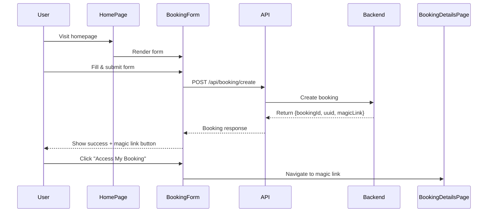
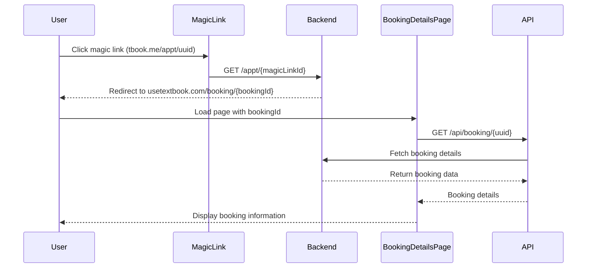

# Simple 2-Screen Integration Guide

This guide explains the simplified integration with just 2 screens as requested.

## 📱 Two Screens Overview

### 1. **Homepage** (`/`)
- Contains the `BookingForm` component
- After successful booking creation, shows a prominent magic link button
- User can click the magic link to go to booking details

### 2. **Booking Details Page** (`/booking/${bookingId}`)
- Shows complete booking information using `BookingDetails` component
- Allows booking confirmation and payment updates
- Accessed via magic link redirect from backend

## 🏗️ Implementation

### Homepage (`src/pages/HomePage.tsx`)

```tsx
import React from 'react';
import { BookingForm } from '../components/BookingForm';

export const HomePage: React.FC = () => {
  return (
    <div className="min-h-screen bg-gray-50">
      {/* Hero Section */}
      <div className="bg-gradient-to-r from-blue-600 to-blue-700 text-white py-16">
        <div className="max-w-4xl mx-auto px-4 sm:px-6 lg:px-8 text-center">
          <h1 className="text-4xl md:text-5xl font-bold mb-4">
            Book Your Appointment
          </h1>
          <p className="text-xl text-blue-100 mb-8">
            Schedule your consultation, tutoring session, or assessment with ease
          </p>
        </div>
      </div>

      {/* Booking Form */}
      <div className="py-12">
        <div className="max-w-4xl mx-auto px-4 sm:px-6 lg:px-8">
          <BookingForm />
        </div>
      </div>
    </div>
  );
};
```

### Booking Details Page (`src/pages/BookingDetailsPage.tsx`)

```tsx
import React from 'react';
import { BookingDetails } from '../components/BookingDetails';

interface BookingDetailsPageProps {
  bookingId?: string;
  onBack?: () => void;
}

export const BookingDetailsPage: React.FC<BookingDetailsPageProps> = ({ 
  bookingId, 
  onBack 
}) => {
  return (
    <div className="min-h-screen bg-gray-50">
      {/* Header with back button */}
      <div className="bg-white shadow-sm border-b border-gray-200">
        <div className="max-w-4xl mx-auto px-4 sm:px-6 lg:px-8 py-4">
          <h1 className="text-2xl font-semibold text-gray-900">
            Booking Details
          </h1>
        </div>
      </div>

      {/* Booking Details */}
      <div className="py-8">
        <div className="max-w-4xl mx-auto px-4 sm:px-6 lg:px-8">
          <BookingDetails 
            uuid={bookingId}
            onPaymentUpdate={(uuid, status) => {
              console.log(`Payment ${status} for booking ${uuid}`);
            }}
          />
        </div>
      </div>
    </div>
  );
};
```

## 🔄 Complete User Flow

### 1. Homepage Booking Creation



### 2. Magic Link to Booking Details



## 🎯 Key Features

### Enhanced BookingForm
- ✅ **Automatic API Integration** - Calls backend API on form submission
- ✅ **Loading States** - Shows spinner during API calls
- ✅ **Success Display** - Large, prominent magic link button after successful creation
- ✅ **Error Handling** - Clear error messages for failed requests
- ✅ **Form Validation** - Client-side validation before submission

### BookingDetails Component
- ✅ **Auto-fetch Data** - Automatically loads booking data by UUID
- ✅ **Status Cards** - Visual status indicators for booking and payment
- ✅ **Action Buttons** - Confirm booking, update payment status
- ✅ **Responsive Design** - Works on all device sizes
- ✅ **Copy to Clipboard** - Easy copying of phone numbers and IDs

## 🚀 Quick Setup

### 1. Environment Configuration
```bash
# .env file
REACT_APP_API_BASE_URL=http://localhost:3000
REACT_APP_MAGIC_LINK_BASE_URL=https://tbook.me
REACT_APP_FRONTEND_BASE_URL=https://usetextbook.com
```

### 2. Using with React Router (Optional)
```tsx
import { BrowserRouter as Router, Routes, Route, useParams } from 'react-router-dom';
import { HomePage } from './pages/HomePage';
import { BookingDetailsPage } from './pages/BookingDetailsPage';

function BookingDetailsRoute() {
  const { bookingId } = useParams<{ bookingId: string }>();
  return <BookingDetailsPage bookingId={bookingId} />;
}

function App() {
  return (
    <Router>
      <Routes>
        <Route path="/" element={<HomePage />} />
        <Route path="/booking/:bookingId" element={<BookingDetailsRoute />} />
      </Routes>
    </Router>
  );
}
```

### 3. Simple Navigation (No Router)
```tsx
import { HomePage } from './pages/HomePage';
import { BookingDetailsPage } from './pages/BookingDetailsPage';

function App() {
  // Auto-detect booking details page from URL
  const path = window.location.pathname;
  const bookingMatch = path.match(/\/booking\/(.+)/);
  
  if (bookingMatch) {
    return <BookingDetailsPage bookingId={bookingMatch[1]} />;
  }
  
  return <HomePage />;
}
```

## 📱 Mobile-First Design

Both screens are fully responsive:

- **Homepage**: Large hero section with centered booking form
- **Booking Details**: Card-based layout that stacks on mobile
- **Touch-Friendly**: Large buttons and touch targets
- **Readable Text**: Proper typography scaling across devices

## 🔧 Customization

### Styling
All components use Tailwind CSS and can be easily customized:

```tsx
// Custom colors
<BookingForm className="custom-form-styles" />

// Custom button styles
<BookingDetailsPage 
  bookingId={uuid}
  className="custom-page-styles"
/>
```

### API Configuration
```typescript
// src/config/environment.ts
export const config = {
  apiBaseUrl: 'https://your-api.com',
  magicLinkBaseUrl: 'https://your-links.com',
  frontendBaseUrl: 'https://your-site.com'
};
```

## 🧪 Testing the Flow

1. **Start Backend**: Run your backend server on localhost:3000
2. **Start Frontend**: Run the React app
3. **Create Booking**: Fill out the form on homepage
4. **Click Magic Link**: Use the prominent button after success
5. **View Details**: See the booking details page with all information

This simplified approach provides a clean, focused user experience with minimal complexity while maintaining all the powerful API integration features. 